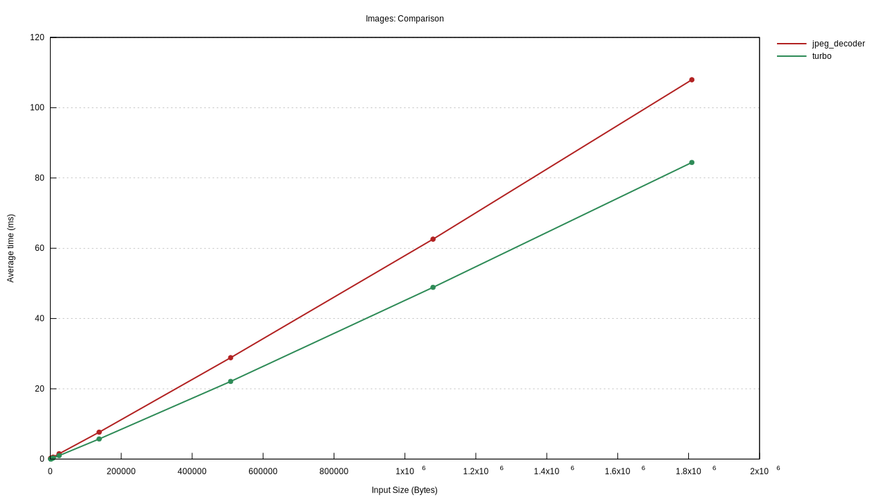
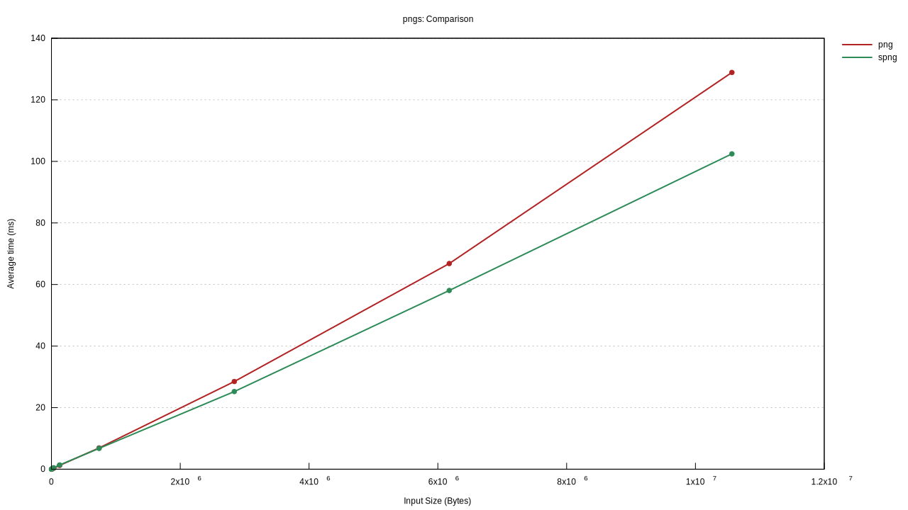

# Benchmarks for Rust Image Decoders

This project runs benchmarks comparing Rust's native image decoders to ones written in C/C++.
At the moment, we only look at decoding JPEG and PNG, but we hope to expand to more.

## Running

To run these, you will need to have libjpeg-turbo installed and in your library path.
For example on Mac OS:

```sh
> brew install jpeg-turbo
> RUSTFLAGS="-L/usr/local/opt/jpeg-turbo/lib" cargo bench
```

## Results

The following results come from a run on a MacOS device with a 2.6GHz 6-Core Intel Core i7 processor and 16GB 2667 MHz DDR4 RAM.



This data is also presented in the graph below.
Very roughly speaking, `jpeg-decoder` is slower than `turbojpeg`, taking roughly an additional 30%
of time to decode the same image for larger images, but much longer on smaller images.

| Test case | jpeg-decoder (ms) | turbojpeg (ms) | jpeg-decoder / turbojpeg |
| :--- | ---: | ---: | ---: |
| venice-10x15.jpg | 0.1101 | 0.01993 | 552% |
| venice-20x30.jpg | 0.1346 | 0.02691 | 500% |
| venice-50x75.jpg | 0.2395 | 0.09818 | 244% |
| venice-100x150.jpg | 0.577 | 0.2972 | 194% |
| venice-200x300.jpg | 1.646 | 0.9864 | 167% |
| venice-500x750.jpg | 8.483 | 5.633 | 151% |
| venice-1000x1500.jpg | 31.82 | 22.74 | 140% |
| venice-1500x2250.jpg | 73.13 | 49.36 | 148% |
| venice-2000x3000.jpg | 126.2 | 84.25 | 150% |

`png` and `spng` are much closer, with `spng` (a wrapper around a C++ library) being faster on larger images and `png`
(written natively in Rust) being faster on smaller ones.



| Test case | png (ms) | spng (ms) | png / spng |
| :--- | ---: | ---: | ---: |
| venice-10x15.png | 0.009756 | 0.004822 | 202% |
| venice-20x30.png | 0.01682 | 0.02313 | 73% |
| venice-50x75.png | 0.06706 | 0.1285 | 52% |
| venice-100x150.png | 0.3028 | 0.4702 | 64% |
| venice-200x300.png | 1.244 | 1.371 | 91% |
| venice-500x750.png | 6.907 | 6.765 | 102% |
| venice-1000x1500.png | 28.48 | 25.22 | 113% |
| venice-1500x2250.png | 66.81 | 58.06 | 115% |
| venice-2000x3000.png | 128.9 | 102.4 | 126% |

## Further work

* Cover more image decoders.
* Find a good corpus of images to use.
* Investigate JPEG decoding at low image sizes.
