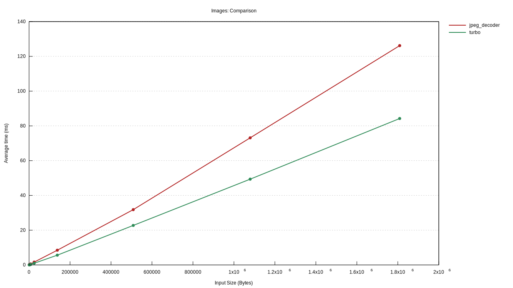

# Benchmarks for Rust Image Decoders

This project runs benchmarks comparing Rust's native image decoders to ones written in C/C++.

## Running

To run these, you will need to have libjpeg-turbo installed and in your library path.
For example on Mac OS:

```sh
> brew install jpeg-turbo
> RUSTFLAGS="-L/usr/local/opt/jpeg-turbo/lib" cargo bench
```

## Results

The following results come from a run on a MacOS device with a 2.6GHz 6-Core Intel Core i7 processor and 16GB 2667 MHz DDR4 RAM.



This data is also presented in the graph below.
Very roughly speaking, `jpeg-decoder` is slower than `turbojpeg`, taking roughly an additional 25%
of time to decode the same image.

| Image Size (pixels) | Image Size (bytes) | jpeg-decoder (ms) | turbojpeg (ms) | jpeg-decoder / turbojpeg |
| ---: | ---: | ---: | ---: | ---: |
| 100x150	| 8,043	    | 0.558	| 0.308	| 181% |
| 500x750	| 137,799	| 7.50	| 5.84	| 128% |
| 1000x1500	| 508,530	| 27.2	| 23.1	| 118% |
| 1500x2250	| 1,079,283	| 63.0	| 61.4	| 103% |
| 2000x3000	| 1,809,144	| 109	| 87.5	| 125% |

## Further work

* Cover more image decoders.
* Find a good corpus of images to use.